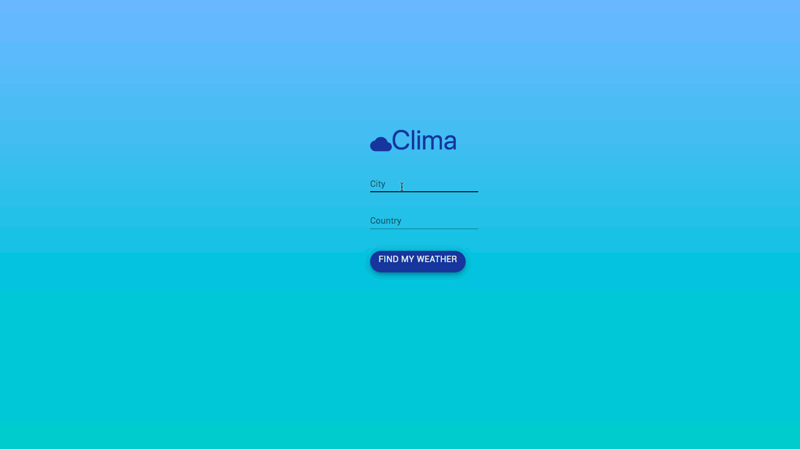

# Clima

### Description:

* Simple Lightweight Weather Web Application I made while self-learning React JS
* Implements a simplistic async function which makes calls to an open Weather web API.

##### LIVE AT: 
Coming Soon…

# UI/Operation:




# Installation
### Requirements:
* React Js
	** Dependencies:
		*** ReactLoading
		*** Material UI
* Node.JS
* 

### Instructions:
* Ensure all Files are in the same directory & all dependencies are installed.
* From Terminal/Powershell run ```npm start``` to start dev server.
* Done!

## Note
* The API is Flexible for Incomplete Makes or Models and therefore in the above example works for the make 'toyo'

